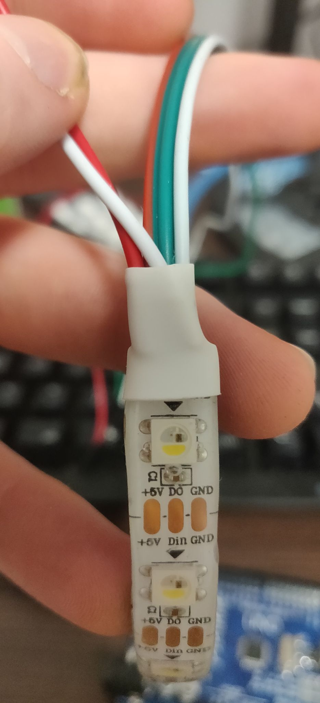
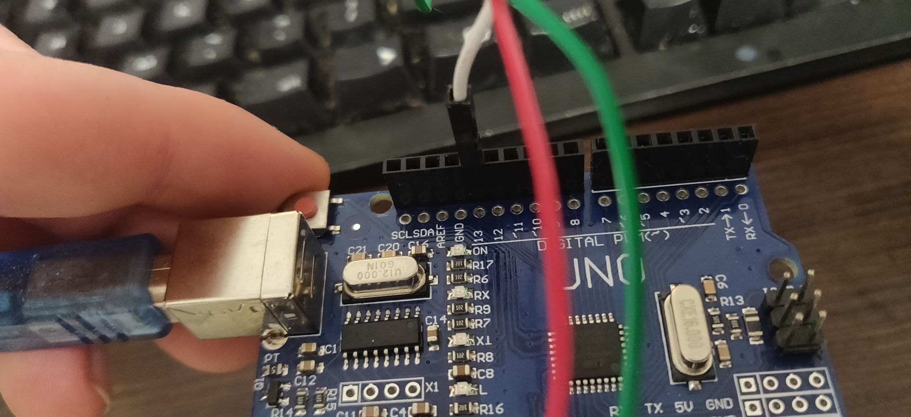
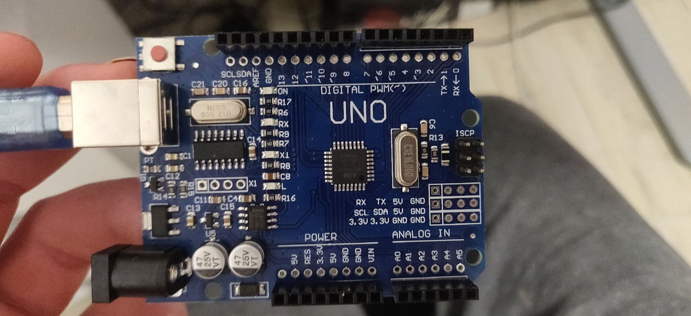
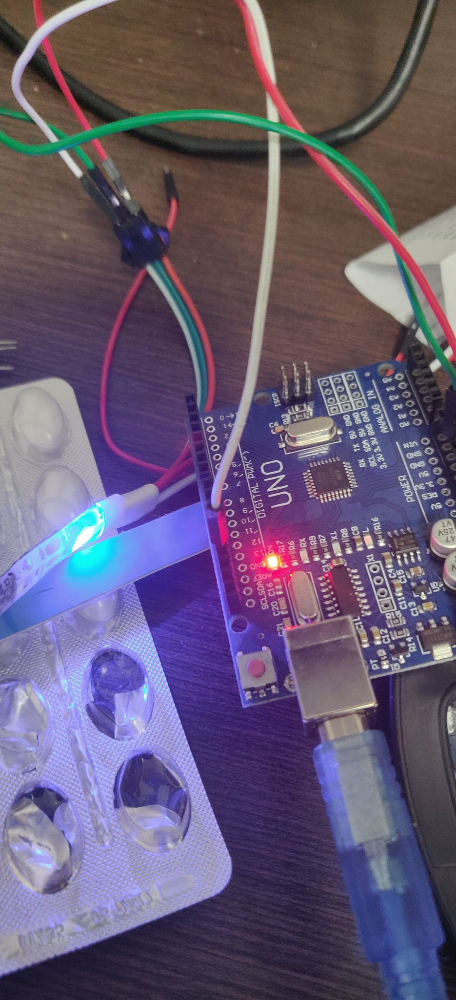
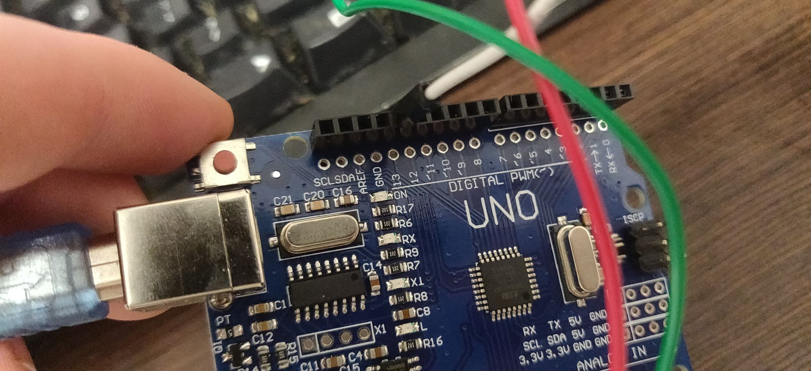
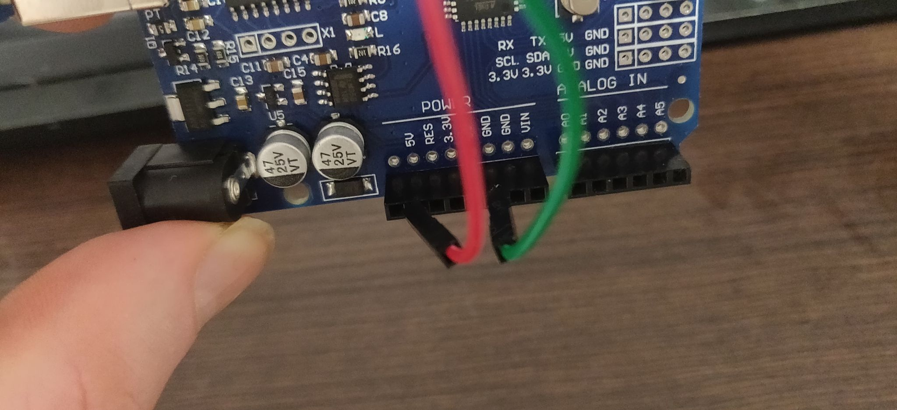

# Redlight
## the hardware I have:
 - Arduino UNO
 - this led strip
 https://allegro.pl/oferta/pasek-led-rgbw-sk6812-cyfrowy-adresowany-ip65-8223045164?snapshot=MjAyMC0xMC0yNFQxODo1MToyNC44MThaO2J1eWVyOzU4NmRlY2IzNzM3ZTY4YzYxNjNiNzQ3YTE3OTRiZDJkOGFkMmVlNmQxNjBhYWRkZTQwN2YyYzA2M2YxYjY1ZDA%3D

## status
it worked once, accidentally, when I unplugged the cable for a split second - it all turned red and stayed like that. unable to reproduce though.

## how I connected it

